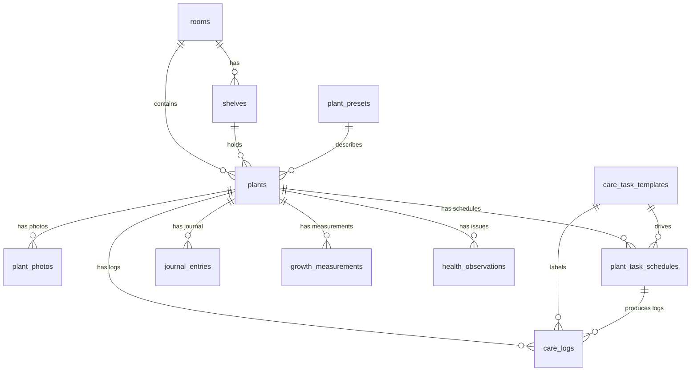

# LeafCue Product Plan

LeafCue is a local-first, privacy-first, offline-first plant care tracker. The
goal is a polished, free product that competes with Planta, Plant Parent, Greg,
and Ploi by leaning hard on data ownership, speed, and design instead of cloud
AI.

## Feature Positioning

- **Privacy first**: every plant, photo, log, and journal entry lives in the
  device's SQLite database. There is no auth, no cookie, no analytics
  pipeline, and no required network call.
- **Offline first**: every screen must work with Wi-Fi off. Care logging, task
  completion, journaling, and plant management all run synchronously against
  the local Drizzle database.
- **Beautiful**: HeroUI Native primitives + the default light/dark themes
  shipped with HeroUI Native give us a premium feel without custom theming.
- **Care logging**: a richer log shape (amount, unit, notes, schedule link)
  than typical free competitors.
- **Timeline-first plant detail**: a single merged feed of care logs, photos,
  growth measurements, journal entries, and health observations per plant.
- **Rooms and shelves**: real organisation primitives so power users can model
  their setup.
- **Data ownership**: import / export shape is reserved in `zod.ts`
  (`exportPayloadSchema`) so a future agent can ship a "download my data"
  feature without renegotiating the schema.

### Competitor advantages

- **vs Planta / Greg / Plant Parent**: no account, no ads, and no aggressive
  paywall. LeafCue stays generous and local-first. An optional **LeafCue Plus**
  subscription only gates power-user features such as unlimited active plants;
  core care tracking remains free. All AI/ML work is optional and can run
  on-device only.
- **vs Ploi**: more thorough data model (rooms, shelves, schedules, growth,
  health, journal) and the timeline view.
- **For everyone**: import and export are first-class concepts; users can move
  on without losing data.

### LeafCue Plus

LeafCue Plus is an optional, auto-renewing subscription powered by RevenueCat.
It exists to fund independent, privacy-first development without ads, accounts,
or a server.

- **Free tier**: up to 20 active plants, unlimited archived plants, and every
  core feature (care tasks, schedules, reminders, logging, journal, photos,
  health, growth, rooms, shelves, export/import) — no account, no ads.
- **Plus unlocks**: unlimited active plants today, plus a foundation for future
  power-user features (advanced local insights, richer export, themes, vacation
  mode).
- **Never held hostage**: subscription state is never persisted as a local
  "pro" flag — RevenueCat's `CustomerInfo` (entitlement `plus`) is the source of
  truth. If Plus lapses, existing plants and all their data stay fully visible,
  editable, and exportable. Only creating or reactivating an active plant beyond
  the free limit requires Plus.
- **Offline-safe**: cached `CustomerInfo` can unlock Plus offline; core local
  flows are never blocked by network errors.

## Data Model

The local SQLite source of truth lives at
[`apps/native/lib/db/schema.ts`](../lib/db/schema.ts) and is exposed as
inferred types in [`apps/native/lib/db/types.ts`](../lib/db/types.ts).

### Tables

- `plants` - the user's tracked plants. Soft-archive via `archivedAt`.
- `plant_photos` - typed (`cover | journal | growth | health | other`) photo
  rows; `cover` photos also update `plants.photoUri`.
- `rooms`, `shelves` - location hierarchy, both with `sortOrder` for manual
  ordering.
- `care_task_templates` - built-in or user-defined care types (water,
  fertilize, mist, prune, repot, rotate, clean leaves, inspect pests, treat
  pests, quarantine, measure growth, photo update, custom note).
- `plant_task_schedules` - per-plant schedules with `intervalDays`,
  `nextDueAt`, `lastCompletedAt`, `snoozedUntil`, `isEnabled`.
- `care_logs` - immutable history of completed care actions. Always linked to
  a plant; optionally to a schedule and template. Powers the timeline.
- `journal_entries` - free-form notes, milestones, issues, treatments, and
  observations, optionally attached to a plant. A single optional
  `photo_uri` mirrors the latest photo for the entry on disk.
- `growth_measurements` - height in cm, leaf count, bloom count, free notes.
- `health_observations` - issues with `issue_type` (yellow_leaves, brown_tips,
  pests, root_rot, wilting, leaf_drop, mold, other), severity
  (`low | medium | high`) and status (`active | improving | resolved`).
- `plant_presets` - the local plant guide. Seeded with 20 common houseplants;
  uniquely indexed on `(common_name, scientific_name)`.
- `app_settings`, `onboarding_state` - key/value stores. Values are JSON and
  validated through caller-supplied Zod schemas.

### Relationships

### Conventions

- Primary keys: `integer PRIMARY KEY AUTOINCREMENT`.
- Timestamps: `INTEGER` epoch milliseconds via Drizzle
  `integer({ mode: "timestamp_ms" })` with `$defaultFn(() => new Date())` for
  `createdAt` / `updatedAt`.
- Booleans: `integer({ mode: "boolean" })`.
- Indexes: see `schema.ts`. Plant filtering, due-task scanning, and timeline
  ordering all go through covering indexes.
- All cross-table writes use `db.transaction(...)` (`completeTask`,
  `addPlantPhoto` with cover update, `runSeeds`).

## Offline-First Rules

- The app must never block a core flow on a network call.
- All read/write helpers in `apps/native/lib/db/repositories` operate on
  `LeafCueDatabase` (or any transaction descended from it). They are
  synchronous against Expo SQLite.
- Migrations are bundled (`apps/native/drizzle/migrations.js` +
  `apps/native/drizzle/0000_*.sql`) and run on app boot via `useMigrations`.
- Seeding runs once after migrations succeed; both seed steps are idempotent
  (no-op when the relevant table is non-empty).
- Validation lives at the boundary: every repository helper parses input
  through a Zod schema before touching SQLite, and `app_settings` /
  `onboarding_state` always parse the stored JSON through a caller-supplied
  schema before returning.
- Future sync, export, and import work must build on the same schema; there
  is a placeholder `exportPayloadSchema` in `zod.ts` for that contract.

## Repository Surface

Re-exported from [`apps/native/lib/db/repositories/index.ts`](../lib/db/repositories/index.ts):

- Plants: `getPlants`, `getPlantById`, `createPlant`, `updatePlant`,
  `archivePlant`, `unarchivePlant`, `getPlantTimeline`.
- Photos: `addPlantPhoto` (transactional cover-photo sync),
  `getPlantPhotos`, `deletePlantPhoto`.
- Rooms / shelves: `getRooms`, `getRoomById`, `createRoom`, `updateRoom`,
  `deleteRoom`, `getShelves`, `createShelf`, `deleteShelf`.
- Tasks: `createSchedule`, `updateSchedule`, `getSchedulesForPlant`,
  `getDueTasks`, `snoozeTask`, `completeTask` (transactional log + reschedule),
  `disableSchedule`, `deleteSchedule`.
- Care logs: `getCareLogsForPlant`, `createCareLog`, `deleteCareLog`.
- Journal: `getJournalEntriesForPlant`, `getRecentJournalEntries`,
  `createJournalEntry`, `updateJournalEntry`, `deleteJournalEntry`.
- Growth: `getGrowthMeasurements`, `addGrowthMeasurement`,
  `deleteGrowthMeasurement`.
- Health: `getHealthObservations`, `addHealthObservation`,
  `updateHealthObservation`, `updateHealthObservationStatus`,
  `deleteHealthObservation`, `getActiveHealthObservationsAcrossPlants`.
- Insights: `getInsightsSummary` (care streak, watering consistency, top
  cared-for, most overdue, recent growth milestones, active health
  issues, recently neglected).
- Presets: `getPresets`, `getPresetById`, `findPresetByName`.
- Templates: `getCareTaskTemplates`, `getCareTaskTemplateByKey`,
  `createCareTaskTemplate`.
- Settings / onboarding: `getSetting`, `setSetting`, `deleteSetting`,
  `getOnboardingState`, `setOnboardingState`, `clearOnboardingState`.

## Care Scheduling Math

When `completeTask` runs:

1. The given `plantTaskSchedule` is loaded (and its template, if linked).
2. A `care_logs` row is inserted with the schedule's `templateId`, the
   resolved `type` (`template.key | schedule.customName | "custom_note"`),
   and the user-provided notes / amount / unit.
3. `intervalDays` is resolved as `schedule.intervalDays ?? template.defaultIntervalDays ?? null`.
4. `nextDueAt` is recomputed as `completedAt + intervalDays * 1 day` when
   interval is known, or set to `null` for one-off cues.
5. `lastCompletedAt` is updated, `snoozedUntil` is cleared.

## Planned Screens

| Area | Status |
| --- | --- |
| Home / care feed | shipped (Today screen with stats, banner, sections) |
| Plant list (rooms, shelves filters) | shipped (`screens/plants/library`) |
| Plant detail (hero, timeline, previews) | shipped (`screens/plants/detail`) |
| Plant journal | shipped (`screens/plants/journal`) |
| Plant photos (with before/after) | shipped (`screens/plants/photos`) |
| Plant growth (with sparkline) | shipped (`screens/plants/growth`) |
| Plant health (advisory hints) | shipped (`screens/plants/health`) |
| Add plant flow (preset picker + form) | shipped |
| Rooms & shelves manager | shipped |
| Care tasks queue, calendar, schedule editor | shipped (step 3) |
| Reminder settings | shipped (step 3) |
| Insights tab | shipped (`screens/insights`) |
| Settings (theme, units, export, import) | partially shipped (theme + reminders) |
| Onboarding wizard (rooms + first plant) | table reserved |

## What the Next Agent Should Build

1. **Onboarding wizard**: read and write progress through `setOnboardingState`
   / `getOnboardingState` and finish by seeding the user's first plant.
2. **Import / export**: implement against `exportPayloadSchema`. Pull every
   table (including `journal_entries.photo_uri`, growth, health,
   schedules, and care logs) to JSON for export; on import, validate and
   write inside a single `db.transaction(...)` so partial imports never
   corrupt the database. Photos can be exported as base64 alongside their
   row, or as a parallel manifest pointing at file paths.
3. **Drag-and-drop reorder for rooms / shelves**: bulk reorder via
   `sortOrder` with `react-native-reanimated`.
4. **Tag plants and tag-based filtering**: add a free-tag column on
   `plants`, surface in the library filter chips, and let insights cluster
   by tag.
5. **Insights polish**: chart watering frequency over time, bring in a
   tappable "Why is this here?" sheet for each card, and add a per-plant
   insights surface inside the detail screen.
6. **Per-plant timeline filters in detail**: extend the timeline filter
   chips to include "Has photo" and "Has notes" toggles.
7. **Settings expansion**: theme picker, default units, photo quality, and
   data ownership flows (export, import, reset).

### Future infrastructure tasks (kept out of scope here)

- Background notifications scheduling refresh task (Expo task module).
- On-device species identification (optional).
- Optional E2EE backup to a user-controlled cloud (no LeafCue server).
- Push-once-per-month "looking back" digest powered by the insights
  summary.
